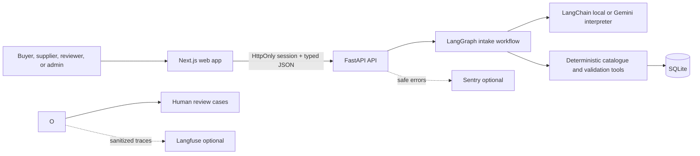

# Procura

Procura is a pharmaceutical procurement operations workspace that turns text, CSV, and XLSX medicine requirements into complete, validated submissions before supplier review begins.

The bundled local dataset uses fictional suppliers, quotes, authorizations, and scenarios. Procura supports procurement review and internal supplier-portal responses; it does not place orders, send external supplier communications, approve compliance, or provide legal or regulatory advice.

## Why it stands out

- A polished responsive SaaS interface with a public landing page and stable routes for buyer, supplier, reviewer, and operations workspaces.
- Secure account sessions using Argon2 password hashes, random HttpOnly cookies, role checks, origin validation, input limits, security headers, and generic login failures.
- A typed provider boundary supporting a no-key local provider plus Gemini and OpenAI hosted providers.
- Deterministic Python tools own supplier search, authorization, destination, cold-chain, units, deadlines, currency, price anomalies, and ranking.
- Unsafe outcomes create persistent human-review cases. Reviewer actions are idempotent, timestamped, and do not create transactions.
- Supplier and quote records are loaded from the database at runtime; supplier-submitted changes require staff verification before becoming active evidence.
- AI-first role workflows reduce form work without bypassing control: suppliers turn one offer description into a typed quotation draft, and reviewers receive an evidence-grounded suggested action before recording their own decision.
- A buyer can open one interpreted request to matching supplier portals. Invited suppliers respond against the buyer's locked medicine variant, staff revalidates current evidence before approval, and every role sees stored notifications and a request timeline.
- Buyers search a database-backed medicine index before starting a request. The API filters server-side and returns at most six focused results to the workspace, with current supplier, quotation, and delivery evidence.
- Shared trace IDs connect local metrics, optional Langfuse observations, and privacy-safe Sentry errors.
- Two readable deterministic evaluation lanes cover supplier decisions and buyer intake, with separate backend and frontend gate tests.
- A LangGraph buyer-intake workflow persists row-level progress, pauses for buyer corrections, resumes after confirmation, and sends only unresolved critical conditions to review.
- LangChain provides the typed Gemini integration and tool contracts. The no-key local interpreter runs the same deterministic graph in development and CI.
- A versioned Ghana FDA reference catalogue recognizes active brands from multiple manufacturers, shows the official source record, and asks the buyer to confirm the generic medicine without silently changing the request.

## Architecture



The graph fixes the order: ingest, parse, normalize, catalogue match, row validation, finding classification, buyer correction interrupt, revalidation, and ready-for-submission. The model interprets wording and proposes typed fields. It cannot skip Python checks or silently accept a medicine correction. Python owns catalogue evidence, calculations, hard eligibility gates, and ranking. Eligible quotations use the documented formula `0.50 × price score + 0.25 × delivery score + 0.25 × reliability`, after hard eligibility checks. Policy is loaded from `knowledge/PROCUREMENT_POLICY.md` at startup and every intake records `procura-policy-v1`.

## Buyer intake engine

Use `/intake` to enter one natural-language requirement or upload a CSV/XLSX list. Files are limited to 5 MB and 2,000 rows, formulas are rejected rather than evaluated, and XLSX archives are bounded before extraction. Header aliases map familiar procurement headings without changing cell values. Every row keeps its original values and receives typed findings, a status, an evidence source, and a suggested action.

Routine omissions, duplicate lines, brand mappings, and close spelling matches return to the buyer. Duplicate rows present a direct choice to remove the row or confirm that both entries are intentional; removed rows remain visible and can be restored before submission. Catalogue suggestions must be accepted or rejected by the signed-in buyer, and every correction records the actor and timestamp. The hosted Gemini interpreter classifies procurement intent semantically as part of its typed output rather than gating requests on a fixed phrase list. The no-key provider uses catalogue-independent clinical structure so unseen medicine names can still reach buyer correction. LangGraph stores its thread checkpoints in SQLite locally or PostgreSQL in production; the intake aggregate is also stored in the application database with optimistic version checks and idempotency keys. A Gemini timeout, outage, or 429 preserves a retryable draft and does not create a staff case.

When a known medicine has the wrong strength, form, or pack size, Procura presents repository-backed variants before the manual editor. Each option shows the exact field changes, verified-supplier count, active quotations, capacity, supported destinations and currencies, fastest quoted delivery, price range, and cold-chain coverage. The buyer can apply a supported destination or currency explicitly and can accept a variant in one action. Variant selection changes only medicine identity fields; requested quantity, destination, delivery requirement, and currency remain unchanged unless the buyer separately changes them. Unknown medicines receive no invented recommendation.

Brand normalization is deterministic. `knowledge/GHANA_MEDICINE_BRANDS.json` contains curated public reference records from the Ghana FDA Product Register, the retrieval date, registration expiry, manufacturer, active ingredient, and direct record URL. The application never queries the public register during a buyer request, so registry downtime cannot block intake. Expired records are ignored, unknown brands remain unresolved, and every recognized mapping requires buyer confirmation. Supplier, price, quotation, and inventory records remain fictional application data.

## Run locally on port 3001

Docker is the shortest path:

```bash
cd /Users/macbookprom1/Desktop/Procura
cp .env.example .env
docker compose up --build
```

Open [http://localhost:3001](http://localhost:3001). The API health endpoint is [http://localhost:8000/health](http://localhost:8000/health).

The app starts with `LLM_PROVIDER=local`; no external key is required. In local development, a buyer account is seeded for the procurement dashboard and workspace:

```text
Email: buyer@procura.example
Password: Procura-Buyer-2026!
```

A separate reviewer account is seeded for procurement and supplier approvals:

```text
Email: reviewer@procura.example
Password: Procura-Reviewer-2026!
```

The local operations administrator is separate from the reviewer:

```text
Email: operations@procura.example
Password: Procura-Admin-2026!
```

Public signup supports buyer and supplier accounts only. Reviewer and administrator privileges cannot be self-assigned. Production role accounts are provisioned from secret environment variables rather than source-controlled credentials.

An invite-linked supplier portal account is also seeded in local development:

```text
Email: supplier@procura.example
Password: Procura-Supplier-2026!
```

Supplier accounts can maintain their linked profile, authorization claim, capabilities, active quotations, withdrawals, and submission history. They can also respond to buyer requests sent to their linked medicine coverage without viewing the buyer conversation. Changes and request-specific offers remain pending until staff review. Suppliers cannot access unrelated requests or staff operations.

Authenticated browser routes are `/dashboard`, `/intake`, `/workspace`, `/supplier`, `/reviews`, `/reviews/suppliers`, `/operations`, and `/admin`. For buyers, `/dashboard` is the overview of saved requirements and supplier decisions, `/intake` is where text or spreadsheet requirements are corrected and submitted, and `/workspace` compares verified supplier quotations for a complete requirement. Role checks are enforced by the API as well as the interface.

| Role | Default route | Access |
|---|---|---|
| Buyer | `/dashboard` | Requirement overview, buyer intake, and supplier comparison workspace |
| Supplier | `/supplier` | Its linked supplier profile, quotation drafting, quotations, and submission history |
| Reviewer | `/reviews` | Evidence briefs, procurement decisions, and supplier approvals |
| Operations admin | `/operations` | Every internal buyer, review, supplier-approval, operations, and read-only administration route; no supplier impersonation |

The administration control center shows real database counts and searchable, paginated account records without exposing password hashes or sessions. It also summarizes supplier, quotation, medicine-variant, open-review, and pending-submission inventory. Medicine search is backed by approved supplier quotation records rather than UI constants.

### Run without Docker

```bash
cd /Users/macbookprom1/Desktop/Procura
python3.12 -m venv .venv
source .venv/bin/activate
pip install -r services/api/requirements.txt
uvicorn app.main:app --app-dir services/api --reload --port 8000
```

In a second terminal:

```bash
cd /Users/macbookprom1/Desktop/Procura/services/web
npm install
NEXT_PUBLIC_API_URL=http://localhost:8000 npm run dev -- --port 3001
```

## Useful commands

```bash
make setup   # install backend and frontend dependencies
make dev     # start the local development services
make test    # backend and frontend gate tests
make eval    # run supplier-decision and buyer-intake deterministic scenarios
make lint    # Python lint and TypeScript/ESLint checks
make build   # production web build and container builds
make down    # stop Docker services
```

## Product walkthrough

1. Create an account or sign in with the local reviewer account.
2. Submit: `1,500 packs of paracetamol 500 mg tablets, pack size 20, delivered to Accra within 18 days in USD.`
3. Inspect the structured request, eligibility evidence, recommendation, trace ID, and policy version.
4. Submit `300 packs of insulin 100 units/ml vials, pack size 10, cold chain, delivered to Ghana within 21 days in USD.` to inspect cold-chain exclusions.
5. Sign in as the reviewer, open Staff review, and record an approval, rejection, or clarification request.
6. Sign in as the supplier and describe: `Offer 4,000 packs of paracetamol 500 mg tablets, pack size 20, at USD 0.44 per pack, within 13 days.` Review the prepared fields, then explicitly submit the quotation for verification.
7. Open Operations to see buyer-intake volume, submitted lists, correction and critical-review counts, first-pass readiness, time to first feedback, time to valid submission, and monitoring status from real local executions.
8. Use the development-only timeout control to verify safe failure and review creation.

## API

| Method | Path | Access |
|---|---|---|
| `POST` | `/api/auth/signup` | Public |
| `POST` | `/api/auth/login` | Public |
| `POST` | `/api/auth/logout` | Session |
| `GET` | `/api/auth/me` | Session |
| `GET` | `/api/dashboard/summary` | Buyer or staff |
| `POST` | `/api/intakes/text` | Buyer or admin |
| `POST` | `/api/intakes/files` | Buyer or admin |
| `GET` | `/api/intakes` | Owning buyer or admin |
| `PATCH` | `/api/intakes/{id}/lines/{line_id}` | Owning buyer or admin |
| `POST` | `/api/intakes/{id}/lines/{line_id}/suggestion` | Owning buyer or admin |
| `POST` | `/api/intakes/{id}/lines/{line_id}/variant` | Owning buyer or admin |
| `POST` | `/api/intakes/{id}/lines/{line_id}/duplicate` | Owning buyer or admin |
| `POST` | `/api/intakes/{id}/revalidate` | Owning buyer or admin |
| `POST` | `/api/intakes/{id}/submit` | Owning buyer or admin |
| `GET` | `/api/catalog/medicines?q=paracetamol&limit=6` | Buyer or admin |
| `GET` | `/api/supplier/dashboard` | Linked supplier |
| `POST` | `/api/supplier/submissions/profile` | Linked supplier |
| `POST` | `/api/supplier/submissions/quotes` | Linked supplier |
| `POST` | `/api/supplier/quote-drafts` | Linked supplier |
| `GET` | `/api/supplier/requests` | Linked supplier invitations |
| `POST` | `/api/supplier/requests/{id}/responses` | Invited linked supplier |
| `GET` | `/api/supplier-submissions` | Reviewer or admin |
| `POST` | `/api/supplier-submissions/{id}/decision` | Reviewer or admin |
| `POST` | `/api/conversations` | Buyer or admin |
| `GET` | `/api/conversations/{id}` | Owner or admin |
| `POST` | `/api/conversations/{id}/messages` | Owner or admin |
| `GET` | `/api/reviews` | Reviewer or admin |
| `GET` | `/api/reviews/{id}/brief` | Reviewer or admin |
| `POST` | `/api/reviews/{id}/decision` | Reviewer or admin |
| `POST` | `/api/executions/{trace_id}/publish` | Owning buyer or admin |
| `GET` | `/api/procurement-requests` | Buyer or staff, role scoped |
| `GET` | `/api/procurement-requests/{id}` | Authorized request participant |
| `GET` | `/api/notifications` | Signed-in account |
| `POST` | `/api/notifications/{id}/read` | Notification owner |
| `GET` | `/api/operations/summary` | Admin |
| `GET` | `/api/admin/overview` | Admin |
| `GET` | `/api/admin/users?q=&role=&status=&page=1&limit=20` | Admin |
| `GET` | `/api/traces/{id}` | Owner or admin |
| `GET` | `/health` | Public |

FastAPI also exposes interactive local API documentation at [http://localhost:8000/docs](http://localhost:8000/docs).

## Configuration

Copy `.env.example` to `.env`. `.env` and SQLite databases are ignored by Git.

| Variable | Default | Purpose |
|---|---|---|
| `WEB_PORT` | `3001` | Browser port |
| `LLM_PROVIDER` | `local` | `local`, `gemini`, or `openai` |
| `LLM_MODEL` | local model label | Provider model ID, such as a Gemini Flash model available to your account |
| `LLM_API_KEY` | empty | Hosted provider credential, stored only in the API environment |
| `LLM_TIMEOUT_SECONDS` | `30` | Hosted-provider request deadline before safe escalation |
| `DATABASE_URL` | SQLite | Application database |
| `LANGGRAPH_CHECKPOINT_PATH` | `./procura-graph.db` | Durable local graph state |
| `INTAKE_MAX_FILE_BYTES` | `5242880` | File upload limit |
| `INTAKE_MAX_ROWS` | `2000` | Total rows per upload |
| `APP_ENV` | `development` | Disables development controls and local accounts in production |
| `BOOTSTRAP_BUYER_*` | empty | Optional seeded buyer credentials |
| `BOOTSTRAP_REVIEWER_*` | empty | Provisioned reviewer credentials |
| `BOOTSTRAP_ADMIN_*` | empty | Provisioned operations-administrator credentials |
| `BOOTSTRAP_SUPPLIER_*` | empty | Optional linked supplier credentials |
| `LANGFUSE_*` | empty | Optional sanitized LLM/tool tracing |
| `SENTRY_DSN` | empty | Optional backend monitoring |
| `NEXT_PUBLIC_SENTRY_DSN` | empty | Optional frontend monitoring |

No credentials are committed. Missing Langfuse or Sentry credentials select no-op adapters, preserve local structured evidence, and are reported honestly in Operations.

### Gemini

Procura uses `langchain-google-genai` for hosted Gemini structured output. Gemini interprets only the buyer's stated facts. LangGraph owns routing and Python owns catalogue matching, supplier search, authorization, destination, cold-chain, unit, deadline, price, and ranking decisions.

Set the following in the API environment. Use a Gemini model ID that is enabled in your Google AI Studio project. Do not expose this key through a `NEXT_PUBLIC_` variable or commit it to Git.

```text
LLM_PROVIDER=gemini
LLM_MODEL=gemini-3.6-flash
LLM_API_KEY=<secret>
```

Invalid structured output is retried once. Provider or SDK failures create a safe human-review case with the shared trace ID. When Gemini returns usage metadata, Procura stores actual input and output token counts in the local trace and Operations summary. Cost remains unavailable unless a verifiable provider cost is recorded.

The hosted integration was manually verified against `gemini-3.6-flash` on 26 August 2026. The checked workflow extracted an omeprazole request, normalized Accra to Ghana, authorized the fixed deterministic tool sequence, recommended the eligible Northstar quotation, recorded 990 input and 126 output tokens, and confirmed that no transaction was completed. Paid-provider evaluations remain opt-in and are not executed in pull-request CI.

## Security model

- Passwords are Argon2-hashed and never returned or logged.
- Session secrets are random, stored only as SHA-256 hashes, and sent in `HttpOnly`, `SameSite=Lax` cookies. Production cookies are `Secure`.
- Mutation requests validate browser origin. CORS permits only the configured web origin and credentials.
- Buyers are isolated from other conversation IDs and staff-only endpoints. Reviewers can act only on review evidence, while administrators can access internal operations without impersonating supplier accounts.
- Pydantic bounds all user-controlled fields; SQLAlchemy parameterizes database access.
- React renders messages as text. The project contains no `dangerouslySetInnerHTML` path for user content.
- Frontend CSP, frame denial, MIME sniffing protection, referrer policy, and browser capability restrictions are enabled.
- Authentication attempts are rate-limited in-process. A distributed deployment should move that state to shared infrastructure.
- Observability sanitization redacts emails, phone numbers, bearer tokens, and likely API keys before export.

## Testing and evaluations

```bash
source /Users/macbookprom1/Desktop/Procura/.venv/bin/activate
pytest -q services/api/tests
cd services/web && npm test -- --run
cd ../api && python evals/run.py
```

The supplier-decision suite remains separate and passed **15/15 scenarios (100%)**. The buyer-intake suite passed **31/31 scenarios (100%)** against a 90% threshold. It covers text, files, missing fields, brand and spelling suggestions, unseen medicines, ambiguous variants, catalogue-backed variant selection, quantity preservation, duplicate removal and intentional-duplicate confirmation, prompt injection content, varied irrelevant and non-medical purchasing input, 429, timeout, invalid model output, regulatory exception routing, and critical review after supplier eligibility checks. The gate suites currently pass **103 backend tests** and **34 frontend tests**. Results are generated from actual executions and written to `services/api/evals/results/intake-latest.json` and `intake-latest.md`.

## Deployment and observability

`docker-compose.yml` supplies health checks and a persistent SQLite volume. `.github/workflows/ci.yml` installs dependencies, lints, type-checks, tests, evaluates, builds the web app, and builds the backend container. Paid model calls are not used in pull requests.

For GCP, create a dedicated project for Procura rather than adding resources to an existing project. The recommended production shape is two Cloud Run services (`procura-web` and `procura-api`), Artifact Registry for the images, Cloud SQL for PostgreSQL, and Secret Manager for credentials. Route the public domain through an external Application Load Balancer so `/api/*` and the web interface share one origin. SQLite must be replaced before Cloud Run deployment because the Cloud Run container filesystem is disposable. No GCP resources are created by this repository.

Langfuse records one sanitized trace per execution when configured. Sentry records application/provider/tool failures with safe correlation tags. Supplier details, full prompts, cookies, passwords, and secrets are excluded from both systems.

## Known limitations and production path

- The built-in rate limiter is process-local.
- SQLite is correct for a single-node local environment, not concurrent production writes. Move the unchanged SQLAlchemy repository boundary to PostgreSQL before multi-instance deployment.
- Session revocation is database-backed, but password reset, email verification, MFA, organization invitations, and admin role management need a trusted email service and production identity policy.
- The SSE contract exists, while the current interface renders bounded progress immediately during synchronous local execution.
- Seed quotations cover 20 medicine names for discovery and interview workflows. They remain fictional procurement records and are not a complete formulary or inventory system.
- External Langfuse, Sentry, and hosted-model delivery require user-owned credentials and were not claimed as externally verified.

## Implementation rationale and rollback

A single readable orchestrator keeps model behavior constrained and makes every factual decision testable. Database-backed sessions were selected over browser tokens so credentials are not exposed to JavaScript and logout can revoke server-side state. Seed data is inserted idempotently into SQLite so supplier evidence is queryable and inspectable instead of being UI constants. The first likely production pressure point is process-local rate limiting, followed by SQLite write contention. Roll back safely by stopping the services and reverting the working-tree changes; no irreversible migration or external transaction is performed.

## License and disclaimer

Procura is an independent procurement application with a bundled sandbox dataset. It uses no real supplier data and is not a purchasing, compliance-approval, medical, legal, or regulatory system.
