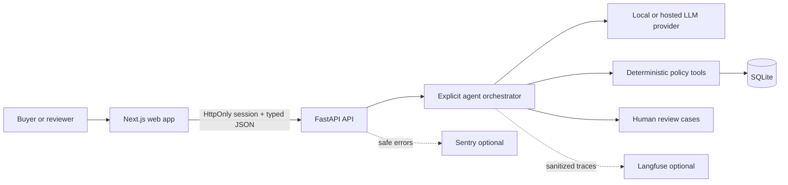

# Procura

Procura is a pharmaceutical procurement operations workspace that converts conversational requests into consistent, auditable supplier decisions.

The bundled local dataset uses fictional suppliers, quotes, authorizations, and scenarios. Procura supports procurement review; it does not place orders, contact suppliers, approve compliance, or provide legal or regulatory advice.

## Why it stands out

- A polished responsive SaaS interface with a public landing page, signup, login, workspace, staff review, operations, and about views.
- Secure account sessions using Argon2 password hashes, random HttpOnly cookies, role checks, origin validation, input limits, security headers, and generic login failures.
- A typed provider boundary supporting a no-key local provider and an optional hosted provider.
- Deterministic Python tools own supplier search, authorization, destination, cold-chain, units, deadlines, currency, price anomalies, and ranking.
- Unsafe outcomes create persistent human-review cases. Reviewer actions are idempotent, timestamped, and do not create transactions.
- Supplier and quote fixtures are seeded idempotently into SQLite and loaded from the database at runtime.
- Shared trace IDs connect local metrics, optional Langfuse observations, and privacy-safe Sentry errors.
- Twelve readable deterministic evaluations and separate backend/frontend gate tests.

## Architecture



The model interprets wording and proposes a typed request/tool sequence. Python owns factual supplier evidence, calculations, hard eligibility gates, and ranking. Eligible quotations use the documented formula `0.50 × price score + 0.25 × delivery score + 0.25 × reliability`, after hard eligibility checks. Policy is loaded from `knowledge/PROCUREMENT_POLICY.md` at startup and every decision records `procura-policy-v1`.

## Run locally on port 3001

Docker is the shortest path:

```bash
cd /Users/macbookprom1/Desktop/Procura
cp .env.example .env
docker compose up --build
```

Open [http://localhost:3001](http://localhost:3001). The API health endpoint is [http://localhost:8000/health](http://localhost:8000/health).

The app starts with `LLM_PROVIDER=local`; no external key is required. In local development only, a reviewer account is seeded for the staff and operations screens:

```text
Email: reviewer@procura.example
Password: Procura-Reviewer-2026!
```

This local reviewer account is never created when `APP_ENV=production`. New signups receive the `buyer` role and cannot access staff-only endpoints.

An invite-linked supplier portal account is also seeded in local development:

```text
Email: supplier@procura.example
Password: Procura-Supplier-2026!
```

Supplier accounts can see only their linked profile, authorization evidence, capabilities, and submitted quotations. They cannot access buyer conversations or staff operations.

### Run without Docker

```bash
cd /Users/macbookprom1/Desktop/Procura
python3.12 -m venv .venv
source .venv/bin/activate
pip install -r services/api/requirements.txt
uvicorn app.main:app --app-dir services/api --reload --port 8000
```

In a second terminal:

```bash
cd /Users/macbookprom1/Desktop/Procura/services/web
npm install
NEXT_PUBLIC_API_URL=http://localhost:8000 npm run dev -- --port 3001
```

## Useful commands

```bash
make setup   # install backend and frontend dependencies
make dev     # start the local development services
make test    # backend and frontend gate tests
make eval    # run all 12 deterministic scenarios
make lint    # Python lint and TypeScript/ESLint checks
make build   # production web build and container builds
make down    # stop Docker services
```

## Product walkthrough

1. Create an account or sign in with the local reviewer account.
2. Submit: `5,000 packs of paracetamol 500 mg tablets, pack size 100, delivered to Accra within 18 days in USD.`
3. Inspect the structured request, eligibility evidence, recommendation, trace ID, and policy version.
4. Submit `300 packs of insulin 100 units/ml vials, pack size 10, cold chain, delivered to Ghana within 21 days in USD.` to inspect cold-chain exclusions.
5. Sign in as the reviewer, open Staff review, and record an approval, rejection, or clarification request.
6. Open Operations to see real local request counts, decision totals, measured latency, eval pass rate, and integration status.
7. Use the development-only timeout control to verify safe failure and review creation.

## API

| Method | Path | Access |
|---|---|---|
| `POST` | `/api/auth/signup` | Public |
| `POST` | `/api/auth/login` | Public |
| `POST` | `/api/auth/logout` | Session |
| `GET` | `/api/auth/me` | Session |
| `GET` | `/api/dashboard/summary` | Buyer or staff |
| `GET` | `/api/supplier/dashboard` | Linked supplier |
| `POST` | `/api/conversations` | Buyer or staff |
| `GET` | `/api/conversations/{id}` | Owner or staff |
| `POST` | `/api/conversations/{id}/messages` | Owner or staff |
| `GET` | `/api/reviews` | Reviewer or admin |
| `POST` | `/api/reviews/{id}/decision` | Reviewer or admin |
| `GET` | `/api/operations/summary` | Reviewer or admin |
| `GET` | `/api/traces/{id}` | Owner or staff |
| `GET` | `/health` | Public |

FastAPI also exposes interactive local API documentation at [http://localhost:8000/docs](http://localhost:8000/docs).

## Configuration

Copy `.env.example` to `.env`. `.env` and SQLite databases are ignored by Git.

| Variable | Default | Purpose |
|---|---|---|
| `WEB_PORT` | `3001` | Browser port |
| `LLM_PROVIDER` | `local` | `local` or configured hosted provider |
| `LLM_MODEL` | local model label | Hosted model name |
| `LLM_API_KEY` | empty | Hosted provider credential |
| `DATABASE_URL` | SQLite | Application database |
| `APP_ENV` | `development` | Disables development controls and local accounts in production |
| `LANGFUSE_*` | empty | Optional sanitized LLM/tool tracing |
| `SENTRY_DSN` | empty | Optional backend monitoring |
| `NEXT_PUBLIC_SENTRY_DSN` | empty | Optional frontend monitoring |

No credentials are committed. Missing Langfuse or Sentry credentials select no-op adapters, preserve local structured evidence, and are reported honestly in Operations.

## Security model

- Passwords are Argon2-hashed and never returned or logged.
- Session secrets are random, stored only as SHA-256 hashes, and sent in `HttpOnly`, `SameSite=Lax` cookies. Production cookies are `Secure`.
- Mutation requests validate browser origin. CORS permits only the configured web origin and credentials.
- Buyers are isolated from other conversation IDs and staff-only review/operations endpoints.
- Pydantic bounds all user-controlled fields; SQLAlchemy parameterizes database access.
- React renders messages as text. The project contains no `dangerouslySetInnerHTML` path for user content.
- Frontend CSP, frame denial, MIME sniffing protection, referrer policy, and browser capability restrictions are enabled.
- Authentication attempts are rate-limited in-process. A distributed deployment should move that state to shared infrastructure.
- Observability sanitization redacts emails, phone numbers, bearer tokens, and likely API keys before export.

## Testing and evaluations

```bash
source /Users/macbookprom1/Desktop/Procura/.venv/bin/activate
pytest -q services/api/tests
cd services/web && npm test -- --run
cd ../api && python evals/run.py
```

Deterministic evaluations cover eligible selection, delivery failure, missing/expired authorization, ambiguity, pack size, destination, cold chain, currency, price anomaly, no eligible quote, and tool timeout. The CI threshold is documented in the eval runner and must be met from actual output; results are written to `services/api/evals/results/latest.json` and `latest.md`.

## Deployment and observability

`docker-compose.yml` supplies health checks and a persistent SQLite volume. `.github/workflows/ci.yml` installs dependencies, lints, type-checks, tests, evaluates, builds the web app, and builds the backend container. Paid model calls are not used in pull requests.

For GCP, create a dedicated project for Procura rather than adding resources to an existing project. The recommended production shape is two Cloud Run services (`procura-web` and `procura-api`), Artifact Registry for the images, Cloud SQL for PostgreSQL, and Secret Manager for credentials. Route the public domain through an external Application Load Balancer so `/api/*` and the web interface share one origin. SQLite must be replaced before Cloud Run deployment because the Cloud Run container filesystem is disposable. No GCP resources are created by this repository.

Langfuse records one sanitized trace per execution when configured. Sentry records application/provider/tool failures with safe correlation tags. Supplier details, full prompts, cookies, passwords, and secrets are excluded from both systems.

## Known limitations and production path

- The built-in rate limiter is process-local.
- SQLite is correct for a single-node local environment, not concurrent production writes. Move the unchanged SQLAlchemy repository boundary to PostgreSQL before multi-instance deployment.
- Session revocation is database-backed, but password reset, email verification, MFA, organization invitations, and admin role management need a trusted email service and production identity policy.
- The SSE contract exists, while the current interface renders bounded progress immediately during synchronous local execution.
- Seed quotations cover amoxicillin, paracetamol, ceftriaxone, and insulin workflows, not a broad medicine catalogue.
- External Langfuse, Sentry, and hosted-model delivery require user-owned credentials and were not claimed as externally verified.

## Implementation rationale and rollback

A single readable orchestrator keeps model behavior constrained and makes every factual decision testable. Database-backed sessions were selected over browser tokens so credentials are not exposed to JavaScript and logout can revoke server-side state. Seed data is inserted idempotently into SQLite so supplier evidence is queryable and inspectable instead of being UI constants. The first likely production pressure point is process-local rate limiting, followed by SQLite write contention. Roll back safely by stopping the services and reverting the working-tree changes; no irreversible migration or external transaction is performed.

## License and disclaimer

Procura is an independent procurement application with a bundled sandbox dataset. It uses no real supplier data and is not a purchasing, compliance-approval, medical, legal, or regulatory system.
